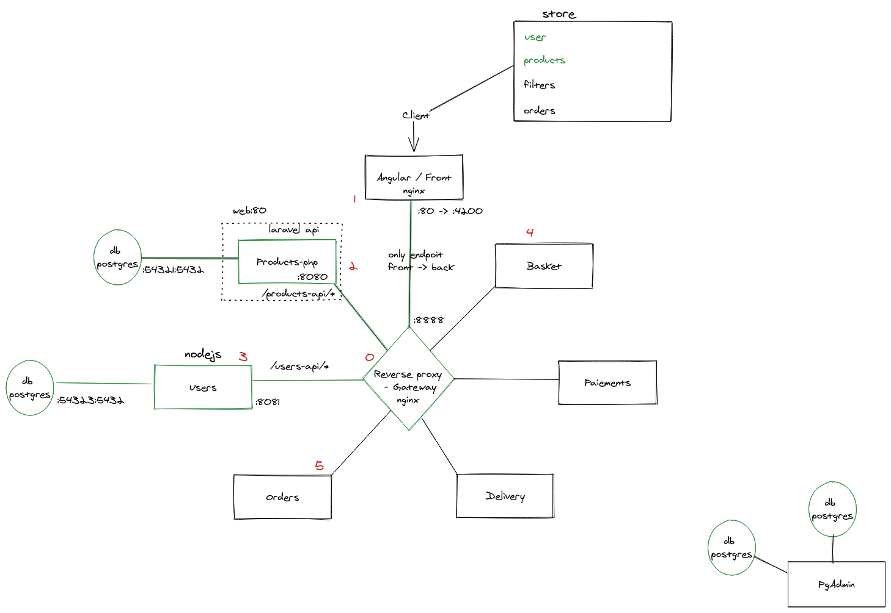

# E-commerce website in micro-services

## Technologies
* nginx
* PHP 8.0
* Composer
* PostgreSQL 12
* Laravel starter code
* pgAdmin 4.27
* Express, nodeJS
* Sequelize ORM

## Architecture


## Getting started
### Prerequisites

Having `docker`, `docker-compose`, `make` installed.

### Installation

1. Clone the project and bring the containers up:
    ```bash
    git clone <URL_REP> ./
    make start
    ```
1. install composer packages:
    ```bash
    # sans Makefile
    docker-compose exec -w /var/www/html php composer install
   # avec Makefile
   make install
    ```
1. Navigate to [http://localhost:4200](http://localhost:4200)
4. Done!

## Connecting to Postgres

Database created by default and that should be used for your application is `app`.
Username is `docker` and password is `secret`.

To connect to postgres DB from `php` application use `db` as a host name and default port (`5432`).

To connect from the host machine use `localhost` as the host name and port `54321`.

## Running `artisan` commands (ex. migrations)

```bash
 # sans Makefile
docker-compose exec -w /var/www/html php php artisan <command>
 # avec Makefile
 make pa " <command>"
```

# Help
```bash
make help
```

# License
This project is licensed under the MIT License - see the [LICENSE.md](LICENSE.md) file for details.
